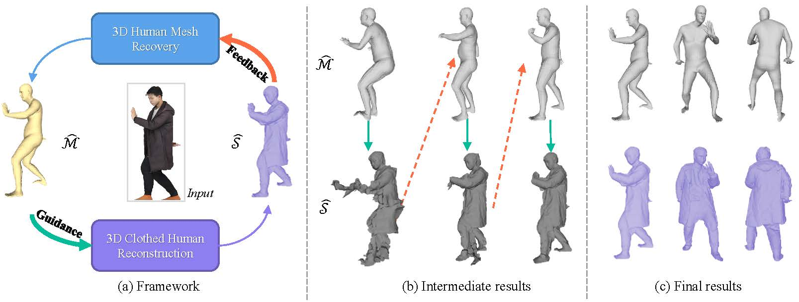
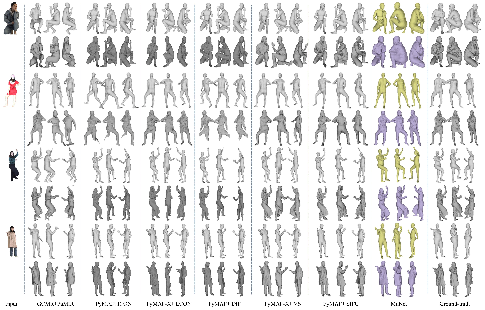

# MuNet: A Mutualistic Network for Joint 3D Human Mesh Recovery and 3D Clothed Human Reconstruction from Single Images

This repository contains the official implementation of **MuNet**, proposed in the paper:  
**"MuNet: A Mutualistic Network for Joint 3D Human Mesh Recovery and 3D Clothed Human Reconstruction from Single Images"**.  


---

## 🔥 Overview
<p align="center">
  
</p>

(a) Framework of joint 3D human mesh recovery and 3D clothed human reconstruction. The tasks of 3D human mesh recovery and 3D clothed human reconstruction form a closed loop: the 3D body model ($\hat{\mathcal{M}}$) generated by 3D human mesh recovery serves as guidance for reconstructing the surface of the 3D clothed human ($\hat{\mathcal{S}}$). 
Subsequently, the surface reconstruction errors are fed back to the 3D human mesh recovery task for improving the 3D body model.
(b) Intermediate results generated by the two tasks during training. It can be observed that 3D human mesh recovery and  3D clothed human reconstruction are mutually beneficial. As with iterations, the results of both tasks are gradually improving. 
(c) The final results show that our method can recover accurate 3D human meshes of humans wearing loose-fitting clothing and reconstruct highly-fidelity 3D clothed human models.

---

## ✨ Results
<p align="center">
  
</p>

---

## ⚙️ Installation

Clone the repository:
```bash
git clone https://github.com/your_username/MuNet.git
cd MuNet


````

Install dependencies:

```bash
pip install -r requirements.txt
```

---

## 🚀 Usage

### Training

```bash
python main_train.py
```

### Evaluation

```bash
python eval.py
```

---

## 📂 Project Structure

```
.
├── networks/           # Network architectures
├── main_train.py       # Training script
├── eval.py             # Evaluation script
├── requirements.txt    # Dependencies
├── README.md           # Project readme
├── first_pic.png       # Overview figure
└── img.png             # Results figure
```

---

## 📖 Citation

If you find this work useful in your research, please consider citing:

```bibtex
@article{YourCitation2025,
  title={MuNet: A Mutualistic Network for Joint 3D Human Mesh Recovery and 3D Clothed Human Reconstruction from Single Images},
  journal={},
  year={2025}
}
```

---

## 🙌 Acknowledgments

This work builds upon prior research in 3D human reconstruction, including SMPL-based mesh recovery and clothed human modeling approaches.
